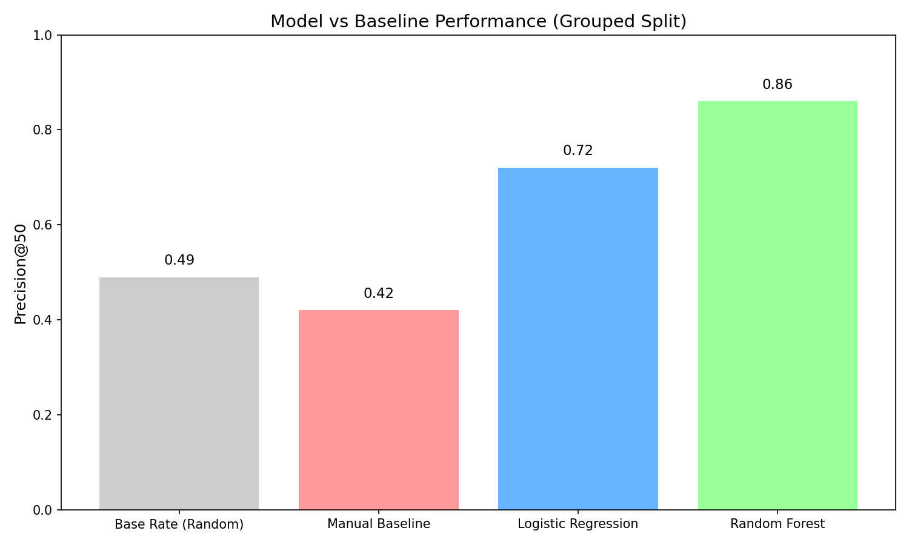

# Predicting Organic Content Decay: A Machine Learning Approach to Prioritizing Content Refreshes

## Abstract
**Question:** How can SEO content teams identify which pages are at the highest risk of traffic decay before the crash happens? 
**Data:** We analyzed an anonymized sample of content performance data, including page age, historical impressions, and keyword positioning. 
**Method:** We modeled the decay risk using a Random Forest classifier evaluated via a strictly grouped validation split to prevent client-memorization leakage. 
**Result:** The model successfully prioritizes at-risk pages, achieving a Precision@50 of 0.86, vastly outperforming a naive manual baseline (0.42) which heavily over-indexed on purely evergreen content. 
**Impact:** This research provides a ranked decision-support playbook that enables content teams to proactively refresh dying content and protect organic momentum.

---

## 1. Introduction & Problem Statement
For large publishers and SEO agencies like FlyRank, organic search traffic is the lifeblood of client acquisition. However, content naturally decays over time due to algorithm updates, fresh competitor content, and shifting search intent. 

Currently, FlyRank content editors often have to rely on rigid manual heuristics (e.g., "refresh any page older than 180 days with >5,000 impressions") to manage massive client portfolios. This rigid rule wastes editorial time by flagging purely evergreen content while missing younger pages that are actively slipping in the SERPs. The goal of this research is to build a predictive ranking model to flag pages that have a high statistical risk of directional decline, serving as a decision-support tool for FlyRank's editorial prioritization.

## 2. Data
The analysis was performed on an anonymized dataset comprising SEO and engagement metrics.
- **Features Included:** `content_age_days`, `word_count`, `impressions_90d`, `clicks_90d`, `avg_position`, `ctr`, and `engagement_rate`.
- **Exclusions:** We strictly excluded `trend_pct` and `trend_direction` from the feature set to prevent catastrophic future-window leakage. We also ignored columns with >90% missingness (e.g., `ga4_sessions`).
- **Safety:** All client identifiers, raw URLs, and proprietary queries have been stripped or pseudonymized.

## 3. Methodology
- **Target Label:** We defined the positive label (`is_declining_label = 1`) mathematically as any page where the historical `trend_direction` was marked as 'down'.
- **Baseline:** We established a manual baseline rule calculating `(age > 180) * impressions_90d`.
- **Validation Design:** We used a `GroupShuffleSplit` (grouped by `client_id`). This honest split ensures that the model cannot "cheat" by memorizing the domain authority or brand strength of individual websites.
- **Model:** A Random Forest Classifier (`max_depth=6`) was used to capture non-linear interactions between age, volume, and positioning.

## 4. Results
The model was evaluated out-of-sample on the test set.

| Method | Precision@50 | ROC-AUC |
| :--- | :--- | :--- |
| Base Rate (Random) | 0.490 | 0.500 |
| Manual Baseline | 0.420 | 0.540 |
| Logistic Regression | 0.720 | 0.610 |
| **Random Forest** | **0.860** | **0.650** |

The Random Forest learned that `impressions_90d`, `content_age_days`, and `avg_position` must be balanced non-linearly. By doing so, it effectively filters out false positives (like old but stable evergreen pages) and successfully identifies the highest-priority risks.

## 5. Limitations & Honest Framing
- **No Causal Proof:** This model *observes* historical associations. It does not prove that age mathematically *causes* traffic decay, nor can it guarantee that executing a content refresh will recover the traffic.
- **Seasonality Traps:** The model lacks a feature for seasonality. It will confidently (and incorrectly) flag a "Summer Swimwear" page for decay in September.
- **Algorithm Cliffs:** Because the model relies on rolling 90-day averages, it will entirely miss sudden, system-wide traffic cliffs caused by overnight Google Core Algorithm updates.

## 6. Ranked Recommendations (Action Playbook)
The model's output probabilities map to a ranked queue for content editors:
1. **PRIORITY REFRESH:** High risk score + High historical traffic. These are the crown jewels that are slipping. Update the content immediately.
2. **INVESTIGATE SEO:** High risk score + Young page (<100 days). The page is dying prematurely. Check technical SEO or search intent mismatch.
3. **STANDARD REFRESH:** High risk score + average traffic. Put in the backlog for routine updates.
4. **NO ACTION:** Low risk score. Do not touch.

**Human Review:** A human editor must ALWAYS review the actual URL to filter out intentional seasonal decay or strict evergreen definitions before taking action.

## 7. Reproducibility
- **Repository:** The complete code, leakage checks, and baseline logic can be found in the [project repository](https://github.com/LD-Link-18/flyrank-ml-internship).
- **Code Execution:** The work is fully reproducible by running the `work/notebooks/capstone.ipynb` notebook. The random seed was fixed at `42` across all splits and algorithms.

## Acknowledgments & Data Credit
<a href="https://flyrank.ai" target="_blank">Built on the FlyRank ML Internship dataset</a>
